# 📱 Control Parental App

Aplicación Android de control parental desarrollada en **Kotlin**, utilizando **Room**, **WorkManager**, **Dagger Hilt** y servicios de accesibilidad para supervisar, limitar y registrar el uso de aplicaciones.

[Propuesta de valor](https://docs.google.com/document/d/12kFZDpTqzES0-sYFv3g2N5VKG0sBjfh_hx_XMg7oy6Q/edit?usp=sharing)

[SRS - Especificación de requisitos](https://docs.google.com/document/d/1rpAelZsWywcVWXfYSeQUA5GreiuIhPb2/edit?usp=sharing&ouid=103592374588151306182&rtpof=true&sd=true)

<div style="display: flex;" align="center">
  
  
</div>

## 🧠 Características principales

- 🕒 Registro de estadísticas de uso por aplicación (tiempo total y diario)
- 🚫 Bloqueo de apps por estado: **BLOQUEADA**, **HORARIO**, **DISPONIBLE**
- ⏱️ Límite de uso diario configurable por app
- 📆 Horarios personalizados para permitir acceso a apps
- 🔐 Servicio de accesibilidad para detectar y cerrar apps no permitidas
- 💾 Persistencia local con **Room**
- 🔁 Tareas en segundo plano usando **WorkManager**
- 🗂️ Logging de bloqueos para auditoría
- 🔔 Notificaciones para recordar permisos o activar el servicio
- 🌐 Sincronización de datos y control remoto en tiempo real mediante panel web Laravel
- 📍 **Ubicación en tiempo real** del dispositivo con sistema de Heartbeat
- 🔋 Monitoreo del nivel de batería del dispositivo

## 🛠️ Tecnologías y herramientas

| Herramienta         | Descripción                                   |
|---------------------|-----------------------------------------------|
| Kotlin              | Lenguaje principal                            |
| Room (SQLite)       | Base de datos local                           |
| Dagger Hilt         | Inyección de dependencias                     |
| WorkManager         | Ejecución de tareas periódicas                |
| AccessibilityService| Detección de apps en primer plano             |
| Retrofit 2 / OkHttp  | Comunicación HTTP y consumo de API REST      |
| Gson Converter       | Serialización/Deserialización de JSON        |
| Jetpack Navigation   | Navegación tipada entre pantallas            |
| Android ViewModel    | Gestión de estado y ciclo de vida            |
| View Binding         | Acceso seguro a vistas sin findViewById      |
| Coroutine / Flow    | Manejo asíncrono y reactivo                   |
| Jsoup               | Scraping opcional para clasificación de apps |
| **Location Services** | **API de ubicación de Android para rastreo GPS**  |
| **BatteryManager**   | **Monitoreo del estado de batería del dispositivo** |

## 📐 Arquitectura

El proyecto sigue una arquitectura modular y desacoplada:

```
📦 app
 ┣ 📂 checkers 🟢 (Validadores para bloqueo de apps)
 ┣ 📂 data 🔵 (Bases de datos y repositorios)
 ┃ ┣ 📂 apps 🔹 (Room: DAOs, entidades, DB, proveedores)
 ┃ ┣ 📂 log 🔸 (Registro de bloqueos)
 ┃ ┗ 📂 remote 🌐 (Sincronización con API REST)
 ┃   ┣ 📄 HeartbeatRequest (Envío de ubicación al servidor)
 ┃   ┣ 📄 DeviceDto (DTO con campos de ubicación)
 ┃   ┣ 📄 EventDto (Estructura de eventos de sincronización)
 ┃   ┣ 📄 PostEventsRequest (Envío de eventos al servidor)
 ┃   ┗ 📄 Mappers (Conversión entre DTOs y entidades)
 ┣ 📂 detectors 🟡 (Detectores de eventos específicos)
 ┣ 📂 di 🟣 (Inyección de dependencias con Dagger Hilt)
 ┣ 📂 handlers 🔴 (Manejo de bloqueos y acciones)
 ┣ 📂 receiver 📥 (Recepción de eventos del sistema)
 ┣ 📂 services ⚙️ (Servicios en segundo plano)
 ┃ ┣ 📄 AppBlockerService (Bloqueo de aplicaciones)
 ┃ ┗ 📄 HeartbeatService 📍 (Envío de ubicación y estado)
 ┣ 📂 UI 🎨 (Interfaz de usuario)
 ┃ ┣ 📂 activities 🖥️ (Pantallas principales)
 ┃ ┣ 📂 adapters 📋 (Adaptadores para listas)
 ┃ ┣ 📂 fragments 🧩 (Fragmentos reutilizables)
 ┃ ┗ 📂 viewmodel 🧠 (ViewModels compartidos)
 ┣ 📂 utils 🛠️ (Funciones y utilidades generales)
 ┣ 📂 workers ⏰ (Trabajos periódicos con WorkManager)
 ┗ 🧠 ControlParentalApp.kt 🚀 (Clase Application principal)

```

### 📍 Sistema de Heartbeat y Ubicación

El sistema implementa un servicio de **HeartbeatService** que:

- **Envía pings periódicos** al servidor (configurable, por defecto cada 25 segundos)
- **Obtiene la ubicación GPS** del dispositivo si hay permisos disponibles
- **Monitorea el nivel de batería** y el modelo del dispositivo
- **Actualiza la información localmente** en la base de datos Room
- **Marca cambios para sincronización** cuando detecta actualizaciones
- **Se gestiona automáticamente** según el estado de autenticación del dispositivo

#### Gestión Automática del HeartbeatService

El servicio se inicia y detiene automáticamente basándose en la disponibilidad de credenciales:

**Inicio Automático:**
- ✅ Al iniciar la aplicación (si hay token)
- ✅ Al completar autenticación exitosa
- ✅ Al reiniciar el dispositivo (si hay token)
- ✅ Al restaurar credenciales

**Detención Automática:**
- ❌ Al detectar dispositivo eliminado (401/403/404)
- ❌ Al limpiar credenciales manualmente
- ❌ Al perder autenticación

**Componentes de Gestión:**

1. **AuthStateReceiver**: BroadcastReceiver que escucha cambios de autenticación
2. **DeviceAuthLocalDataSource**: Notifica cambios de estado al guardar/eliminar tokens
3. **BootReceiver**: Inicia el servicio tras reinicio si hay credenciales
4. **DeviceDeletedInterceptor**: Detiene el servicio al detectar errores de auth

**Flujo de datos de ubicación:**

```
GPS/Network Provider → HeartbeatService → HeartbeatRequest → API Server
                           ↓
                      DeviceEntity (Room DB)
                           ↓
                    EventSyncManager → Sincronización completa
```

**Estructura de datos:**

- **HeartbeatRequest**: Contiene `latitude` y `longitude` opcionales
- **DeviceDto**: Incluye campos de ubicación para sincronización completa
- **DeviceEntity**: Almacena localmente:
  - `latitude`, `longitude`: Coordenadas GPS
  - `locationUpdatedAt`: Timestamp de última actualización
  - `lastSeen`: Último heartbeat recibido
  - `pingIntervalSeconds`: Intervalo configurable de heartbeat

**Manejo de Ubicación:**
- Intenta obtener última ubicación conocida primero
- Si la ubicación es antigua (>1 minuto), solicita nueva ubicación
- Timeout de 10 segundos para solicitudes de ubicación
- Soporta tanto GPS como Network Provider

## 📋 Permisos necesarios

- `PACKAGE_USAGE_STATS`
- `BIND_ACCESSIBILITY_SERVICE`
- `RECEIVE_BOOT_COMPLETED`
- `INTERNET`
- `POST_NOTIFICATIONS`
- `SYSTEM_ALERT_WINDOW`
- **`ACCESS_FINE_LOCATION`** - Para obtener ubicación GPS precisa
- **`ACCESS_COARSE_LOCATION`** - Para ubicación aproximada por red

## 📌 Diagrama de casos de uso

[Podés visualizar el diagrama de casos de uso](https://lucid.app/lucidchart/6ba2d302-7073-4598-b272-1eeeb985a417/edit?viewport_loc=-5688%2C-462%2C3647%2C2088%2CsjI~UfAdr-eT&invitationId=inv_18c096de-ea59-49dc-8db0-ff7b3636c7fe)


## 📌 Diagrama de clases

[Podés visualizar el diagrama de clases UML usando este link](https://lucid.app/lucidchart/6ba2d302-7073-4598-b272-1eeeb985a417/edit?viewport_loc=-1924%2C336%2C4200%2C2404%2CCmMawoI6KhXr&invitationId=inv_18c096de-ea59-49dc-8db0-ff7b3636c7fe)


## 📌 Diagrama de entidad-relación

Base de datos principal:

<div align="center">
  
</div>


## 🔑 Configuración de la firma

Para compilar la aplicación con firma de lanzamiento necesitás un archivo de
keystore ubicado en `app/keyControl.jks` que **no está incluido en el repositorio**.
Las contraseñas se obtienen desde variables de entorno o desde tu archivo
`gradle.properties` local:

```properties
STORE_PASSWORD=tuStorePassword
KEY_PASSWORD=tuKeyPassword
```

También podés exportar `STORE_PASSWORD` y `KEY_PASSWORD` antes de ejecutar
`./gradlew assembleRelease`.

## 🧑‍💻 Autor

**Gleb Ursol**  
📍 Buenos Aires, Argentina  
🎓 Analista de Sistemas | Estudiante de Escuela Da Vinci

## 📄 Licencia

Este proyecto se publica bajo la [MIT License](LICENSE).

## 🔄 Arquitectura de Sincronización

### Flujo de Sincronización Completo

El sistema implementa un flujo de sincronización híbrido que combina sincronización completa inicial con sincronización incremental basada en eventos:

```mermaid
graph TD
    subgraph "Cliente Android"
        A[App Inicia] --> B{¿Primera sync?}
        B -->|Sí| C[Sync Completa]
        B -->|No| D[Sync Incremental]
        
        C --> E[getHorarios<br/>getApps]
        D --> F[EventSyncManager]
        
        E --> G[NetworkBoundResource]
        F --> H[GET /sync/status]
        
        H --> I{¿Cambios<br/>pendientes?}
        I -->|Sí| J[GET /sync/events]
        I -->|No| K[POST /sync/events]
        
        J --> L[Aplicar cambios<br/>remotos]
        L --> K
        K --> M[Enviar cambios<br/>locales]
    end
    
    subgraph "Servidor Laravel"
        N[API Endpoints]
        O[sync_events table]
        P[Event Controllers]
        
        N --> O
        O --> P
    end
    
    G -.-> N
    J -.-> N
    K -.-> N
    H -.-> N
```



### Estados de Sincronización


### Sincronización Inicial (Primera vez)

```mermaid
sequenceDiagram
    participant App as Android App
    participant NBR as NetworkBoundResource
    participant API as Laravel API
    participant DB as Local SQLite
    
    App->>NBR: getHorarios(deviceId)
    Note over NBR: shouldFetch = true<br/>(no hay datos locales)
    NBR->>API: GET /api/sync/horarios?deviceId=X
    API-->>NBR: Lista completa de horarios
    NBR->>DB: Sincronización inteligente<br/>(solo cambios necesarios)
    NBR-->>App: Resource.Success(horarios)
    
    App->>NBR: getApps(deviceId)
    NBR->>API: GET /api/sync/apps?deviceId=X
    API-->>NBR: Lista completa de apps
    NBR->>DB: Sincronización inteligente<br/>(preserva íconos locales)
    NBR-->>App: Resource.Success(apps)
```



### Sincronización Incremental


### Detección y Propagación de Cambios


### Componentes Clave

#### 1. **NetworkBoundResource**
- Patrón que combina datos locales con datos remotos
- Emite estados: Loading → Success/Error
- Implementa sincronización inteligente (solo actualiza cambios)

#### 2. **EventSyncManager**
- Gestiona la sincronización bidireccional de eventos
- Mantiene el `lastEventId` para sincronización incremental
- Maneja reintentos y recuperación de errores
- Genera y procesa objetos EventDto para cada cambio

#### 3. **SyncHandler**
- Rastrea cambios locales pendientes en SharedPreferences
- Expone StateFlows reactivos para la UI
- Maneja flags de sincronización por tipo de entidad

#### 4. **ModernSyncWorker**
- Worker periódico que ejecuta cada 15 segundos
- Implementa el flujo ideal: primera sync completa, luego incremental
- Maneja errores y programa reintentos automáticos

#### 5. **EventDto** 
- Estructura central para la comunicación de eventos entre cliente y servidor
- Soporta tres tipos de entidades: `horario`, `app`, `device`
- Tres acciones posibles: `create`, `update`, `delete`
- Incluye timestamp ISO 8601 para ordenamiento temporal
- Campo `data` opcional con la información completa de la entidad (solo para create/update)

**Estructura de EventDto:**
```kotlin
data class EventDto(
    val entity_type: String,      // "horario", "app", "device"
    val entity_id: String,        // ID único o packageName
    val action: String,           // "create", "update", "delete"
    val data: Map<String, Any?>?, // Datos completos (opcional)
    val timestamp: String         // ISO 8601 timestamp
)
```

**Ejemplo de uso en sincronización:**
```json
{
  "deviceId": "abc-123-def-456",
  "events": [
    {
      "entity_type": "horario",
      "entity_id": "123",
      "action": "update",
      "data": {
        "nombreDeHorario": "Horario Escolar",
        "horaInicio": "08:00",
        "horaFin": "14:00"
      },
      "timestamp": "2025-06-29T10:30:00Z"
    }
  ]
}
```

### Optimizaciones Implementadas

1. **Sincronización Inteligente**: Solo se actualizan registros que realmente cambiaron
2. **Preservación de Íconos**: Los íconos de apps se mantienen locales, no se descargan
3. **Detección de Cambios**: Sistema de flags para marcar entidades con cambios pendientes
4. **Reintentos Automáticos**: En caso de error, se programan reintentos con backoff
5. **Estado Reactivo**: La UI se actualiza automáticamente con cambios de sincronización

## Flujo de Sincronización

El sistema utiliza una arquitectura de sincronización incremental basada en eventos para mantener los datos consistentes entre el cliente y el servidor de manera eficiente. Esto evita la necesidad de transferir bases de datos completas, enviando únicamente los cambios específicos que han ocurrido.

### Estructura de Eventos (EventDto)

Cada cambio en el sistema se representa como un **EventDto**, que es la unidad fundamental de sincronización:

- **entity_type**: Tipo de entidad modificada (`horario`, `app`, `device`)
- **entity_id**: Identificador único de la entidad
- **action**: Acción realizada (`create`, `update`, `delete`)
- **data**: Datos completos de la entidad (solo para create/update)
- **timestamp**: Marca temporal ISO 8601 para ordenamiento

### 1. Sincronización del Cliente al Servidor

Cuando un usuario realiza un cambio en la aplicación Android (por ejemplo, crear, actualizar o eliminar un horario), el sistema no envía la lista completa de datos. En su lugar, registra la acción específica y la sincroniza con el servidor.

**Generación de EventDto en el Cliente:**

El `EventSyncManager` colecta automáticamente los cambios locales pendientes y los convierte en objetos EventDto:

```kotlin
// Ejemplo de generación de EventDto para un horario actualizado
EventDto(
    entity_type = "horario",
    entity_id = "123",
    action = "update",
    data = mapOf(
        "nombreDeHorario" to "Horario Escolar",
        "diasDeSemana" to listOf(1, 2, 3, 4, 5),
        "horaInicio" to "08:00",
        "horaFin" to "14:00",
        "isActive" to true
    ),
    timestamp = "2025-06-29T10:30:00Z"
)
```

**Flujo de Colección de Eventos:**
1. **Detección de cambios**: SyncHandler marca IDs de entidades modificadas
2. **Colección**: EventSyncManager consulta las entidades marcadas
3. **Conversión**: Cada entidad se convierte a EventDto según su tipo
4. **Agrupación**: Los eventos se agrupan en PostEventsRequest
5. **Envío**: POST /api/sync/events con todos los cambios pendientes

**Ejemplo: Eliminación de un Horario**

1.  **Acción del Usuario:** El usuario elimina un horario en la app.
2.  **Actualización Local:** La app borra el horario de la base de datos local (Room) y, crucialmente, anota el ID del horario eliminado en una "lista de tareas pendientes" (`SharedPreferences`).
3.  **Ciclo de Sincronización:** Un `WorkManager` en segundo plano se activa periódicamente.
4.  **Envío de Cambios:** El `EventSyncManager` revisa la lista de tareas y genera un evento de tipo `delete` para cada ID pendiente.
5.  **Procesamiento del Servidor:** El servidor recibe el evento, elimina el registro correspondiente y notifica al cliente.
6.  **Limpieza:** Una vez confirmada la sincronización, el cliente limpia el ID de su lista de tareas pendientes.

```mermaid
sequenceDiagram
    participant Usuario
    participant Cliente Android
    participant Servidor

    Usuario->>+Cliente Android: Eliminar Horario (ID: 5)
    Cliente Android->>Cliente Android: 1. Borra de Room (id: 5)
    Cliente Android->>Cliente Android: 2. Anota en SharedPreferences: "eliminar ID 5"
    Note right of Cliente Android: La UI se actualiza al instante
    deactivate Cliente Android

    loop Ciclo de Sincronización (Worker)
        Cliente Android->>+Cliente Android: 3. Lee "eliminar ID 5"
        Cliente Android->>+Servidor: 4. POST /sync/events<br/>(action: 'delete', id: 5)
        Servidor->>+Servidor: 5. Borra Horario 5 de su BD
        Servidor-->>-Cliente Android: 6. 200 OK
        Cliente Android->>+Cliente Android: 7. Limpia la lista de tareas
        deactivate Cliente Android
    end
```



### 2. Sincronización del Servidor al Cliente

Cuando se realiza un cambio directamente en el servidor (por ejemplo, a través de una interfaz web), el sistema lo registra en un "diario de novedades" (la tabla `sync_events`). El cliente consulta periódicamente este diario para mantenerse actualizado.

**Procesamiento de EventDto del Servidor:**

El cliente recibe eventos del servidor en formato EventDto y los procesa según su tipo y acción:

```kotlin
// Procesamiento de eventos recibidos
when (event.entity_type) {
    "horario" -> when (event.action) {
        "create" -> createHorarioFromData(event.data)
        "update" -> updateHorarioFromData(event.entity_id, event.data)
        "delete" -> deleteHorario(event.entity_id)
    }
    "app" -> when (event.action) {
        "update" -> updateAppFromData(event.entity_id, event.data)
        "delete" -> deleteApp(event.entity_id)
    }
    "device" -> when (event.action) {
        "update" -> updateDeviceFromData(event.data)
    }
}
```

**Ejemplo: Creación de un Horario en el Servidor**

1.  **Acción en el Servidor:** Un administrador crea un nuevo horario desde la interfaz web.
2.  **Registro del Evento:** El servidor guarda el nuevo horario y, a continuación, crea un registro en la tabla `sync_events` con un ID autoincremental, describiendo la acción (ej: "se creó el horario 8").
3.  **Consulta del Cliente:** En el siguiente ciclo de sincronización, el cliente pregunta al servidor por los eventos ocurridos desde la última vez que se conectó, utilizando el último ID de evento que procesó (`lastEventId`).
4.  **Respuesta del Servidor:** El servidor devuelve una lista con todos los eventos nuevos (aquellos con un ID mayor al `lastEventId` del cliente).
5.  **Actualización Local:** El cliente procesa cada evento recibido, aplica los cambios a su base de datos Room y actualiza su `lastEventId` para el próximo ciclo.

```mermaid
sequenceDiagram
    participant Usuario Web
    participant Servidor
    participant Cliente Android

    Usuario Web->>+Servidor: Crear Horario (ID: 8) vía Web
    Servidor->>Servidor: 1. Guarda Horario 8 en su BD
    Servidor->>Servidor: 2. Anota en tabla `sync_events`: <br/> "create horario 8" (obtiene ID de evento: 38)
    deactivate Servidor

    loop Ciclo de Sincronización (Worker)
        Cliente Android->>+Cliente Android: 3. Lee de SharedPreferences: <br/> "último evento visto = 37"
        Cliente Android->>+Servidor: 4. GET /sync/events?lastEventId=37
        Servidor->>+Servidor: 5. Busca eventos donde ID > 37
        Servidor-->>-Cliente Android: 6. Responde con Evento 38 <br/> y `lastEventId: 38`
        Cliente Android->>+Cliente Android: 7. Crea el Horario 8 en Room
        Cliente Android->>+Cliente Android: 8. Guarda en SharedPreferences: <br/> "último evento visto = 38"
        Note right of Cliente Android: La UI se actualiza al instante
        deactivate Cliente Android
    end
```



### Ventajas de la Arquitectura basada en EventDto

La utilización de **EventDto** como unidad fundamental de sincronización proporciona:

1. **Eficiencia en la Transferencia**: Solo se transfieren los cambios, no datos completos
2. **Trazabilidad Completa**: Cada evento tiene timestamp y acción específica
3. **Flexibilidad**: Fácil agregar nuevos tipos de entidades sin cambiar la arquitectura
4. **Resiliencia**: Los eventos se pueden reintentar individualmente en caso de fallo
5. **Orden Garantizado**: Los timestamps ISO 8601 aseguran el orden correcto de aplicación
6. **Sincronización Bidireccional**: El mismo formato sirve para cliente→servidor y servidor→cliente
7. **Auditoría**: Historial completo de cambios en la tabla `sync_events` del servidor

## 🔐 Sistema de Autenticación de Dispositivos

### Flujo de Autenticación

El sistema implementa un flujo de autenticación robusto para dispositivos:

1. **Registro del Dispositivo**:
   - El dispositivo genera un ID único
   - Se registra en el servidor con nombre y modelo
   - Recibe un código de verificación de 6 dígitos

2. **Verificación Parental**:
   - Los padres ingresan el código en el panel web
   - El servidor valida y aprueba el dispositivo
   - Se genera un token JWT para el dispositivo

3. **Obtención del Token**:
   - El dispositivo consulta periódicamente el estado
   - Al ser aprobado, recibe el token de autenticación
   - El token se almacena en SharedPreferences encriptadas

### Arquitectura de Autenticación

```
📂 auth
 ┣ 📂 local
 ┃ ┗ 📄 DeviceAuthLocalDataSource (Gestión de credenciales locales)
 ┣ 📂 remote
 ┃ ┣ 📄 DeviceAuthApi (Endpoints de autenticación)
 ┃ ┗ 📄 DeviceAuthInterceptor (Inyección de token en requests)
 ┣ 📂 repository
 ┃ ┗ 📄 DeviceAuthRepositoryImpl (Lógica de negocio)
 ┣ 📂 model
 ┃ ┗ 📄 DeviceToken (Modelo de datos)
 ┗ 📂 interceptors
   ┗ 📄 DeviceDeletedInterceptor (Detección de dispositivo eliminado)
```

### Gestión de Estados

El sistema maneja tres niveles de estado:

1. **Sin Registrar**: No hay deviceId
2. **Registrado**: Tiene deviceId pero no token
3. **Verificado**: Tiene deviceId y token válido

### Manejo de Errores de Autenticación

- **401 Unauthorized**: Token inválido o expirado
- **403 Forbidden**: Dispositivo bloqueado o sin permisos
- **404 Not Found**: Dispositivo no existe en el servidor
- **429 Too Many Requests**: Límite de rate limiting alcanzado

Todos estos errores resultan en:
1. Detención del HeartbeatService
2. Limpieza de credenciales (manteniendo deviceId para datos locales)
3. Redirección a pantalla de autenticación

### Seguridad

- **SharedPreferences Encriptadas**: Usa AES256 para almacenar tokens
- **JWT Tokens**: Autenticación sin estado con expiración
- **Rate Limiting**: Protección contra ataques de fuerza bruta
- **Validación Bidireccional**: Código de verificación + aprobación parental


