# 📱 Control Parental App

Aplicación Android de control parental desarrollada en **Kotlin**, utilizando **Room**, **WorkManager**, **Dagger Hilt** y servicios de accesibilidad para supervisar, limitar y registrar el uso de aplicaciones.

[Propuesta de valor](https://docs.google.com/document/d/12kFZDpTqzES0-sYFv3g2N5VKG0sBjfh_hx_XMg7oy6Q/edit?usp=sharing)

[SRS - Especificación de requisitos](https://docs.google.com/document/d/1rpAelZsWywcVWXfYSeQUA5GreiuIhPb2/edit?usp=sharing&ouid=103592374588151306182&rtpof=true&sd=true)

<div style="display: flex;" align="center">
  
  
</div>

## 🧠 Características principales

- 🕒 Registro de estadísticas de uso por aplicación (tiempo total y diario)
- 🚫 Bloqueo de apps por estado: **BLOQUEADA**, **HORARIO**, **DISPONIBLE**
- ⏱️ Límite de uso diario configurable por app
- 📆 Horarios personalizados para permitir acceso a apps
- 🔐 Servicio de accesibilidad para detectar y cerrar apps no permitidas
- 💾 Persistencia local con **Room**
- 🔁 Tareas en segundo plano usando **WorkManager**
- 🗂️ Logging de bloqueos para auditoría
- 🔔 Notificaciones para recordar permisos o activar el servicio
- 🌐 Sincronización de datos y control remoto en tiempo real mediante panel web Laravel

## 🛠️ Tecnologías y herramientas

| Herramienta         | Descripción                                   |
|---------------------|-----------------------------------------------|
| Kotlin              | Lenguaje principal                            |
| Room (SQLite)       | Base de datos local                           |
| Dagger Hilt         | Inyección de dependencias                     |
| WorkManager         | Ejecución de tareas periódicas                |
| AccessibilityService| Detección de apps en primer plano             |
| Retrofit 2 / OkHttp  | Comunicación HTTP y consumo de API REST      |
| Gson Converter       | Serialización/Deserialización de JSON        |
| Jetpack Navigation   | Navegación tipada entre pantallas            |
| Android ViewModel    | Gestión de estado y ciclo de vida            |
| View Binding         | Acceso seguro a vistas sin findViewById      |
| Coroutine / Flow    | Manejo asíncrono y reactivo                   |
| Jsoup               | Scraping opcional para clasificación de apps |

## 📐 Arquitectura

El proyecto sigue una arquitectura modular y desacoplada:

```
📦 app
 ┣ 📂 checkers 🟢 (Validadores para bloqueo de apps)
 ┣ 📂 data 🔵 (Bases de datos y repositorios)
 ┃ ┣ 📂 apps 🔹 (Room: DAOs, entidades, DB, proveedores)
 ┃ ┣ 📂 log 🔸 (Registro de bloqueos)
 ┃ ┗ 📂 remote 🌐 (Sincronización con API REST)
 ┣ 📂 detectors 🟡 (Detectores de eventos específicos)
 ┣ 📂 di 🟣 (Inyección de dependencias con Dagger Hilt)
 ┣ 📂 handlers 🔴 (Manejo de bloqueos y acciones)
 ┣ 📂 receiver 📥 (Recepción de eventos del sistema)
 ┣ 📂 services ⚙️ (Servicios en segundo plano)
 ┣ 📂 UI 🎨 (Interfaz de usuario)
 ┃ ┣ 📂 activities 🖥️ (Pantallas principales)
 ┃ ┣ 📂 adapters 📋 (Adaptadores para listas)
 ┃ ┣ 📂 fragments 🧩 (Fragmentos reutilizables)
 ┃ ┗ 📂 viewmodel 🧠 (ViewModels compartidos)
 ┣ 📂 utils 🛠️ (Funciones y utilidades generales)
 ┣ 📂 workers ⏰ (Trabajos periódicos con WorkManager)
 ┗ 🧠 ControlParentalApp.kt 🚀 (Clase Application principal)

```

## 📋 Permisos necesarios

- `PACKAGE_USAGE_STATS`
- `BIND_ACCESSIBILITY_SERVICE`
- `RECEIVE_BOOT_COMPLETED`
- `INTERNET`
- `POST_NOTIFICATIONS`
- `SYSTEM_ALERT_WINDOW`

## 📌 Diagrama de casos de uso

[Podés visualizar el diagrama de casos de uso](https://lucid.app/lucidchart/6ba2d302-7073-4598-b272-1eeeb985a417/edit?viewport_loc=-5688%2C-462%2C3647%2C2088%2CsjI~UfAdr-eT&invitationId=inv_18c096de-ea59-49dc-8db0-ff7b3636c7fe)


## 📌 Diagrama de clases

[Podés visualizar el diagrama de clases UML usando este link](https://lucid.app/lucidchart/6ba2d302-7073-4598-b272-1eeeb985a417/edit?viewport_loc=-1924%2C336%2C4200%2C2404%2CCmMawoI6KhXr&invitationId=inv_18c096de-ea59-49dc-8db0-ff7b3636c7fe)


## 📌 Diagrama de entidad-relación

Base de datos principal:

<div align="center">
  
</div>


## 🔑 Configuración de la firma

Para compilar la aplicación con firma de lanzamiento necesitás un archivo de
keystore ubicado en `app/keyControl.jks` que **no está incluido en el repositorio**.
Las contraseñas se obtienen desde variables de entorno o desde tu archivo
`gradle.properties` local:

```properties
STORE_PASSWORD=tuStorePassword
KEY_PASSWORD=tuKeyPassword
```

También podés exportar `STORE_PASSWORD` y `KEY_PASSWORD` antes de ejecutar
`./gradlew assembleRelease`.

## 🧑‍💻 Autor

**Gleb Ursol**  
📍 Buenos Aires, Argentina  
🎓 Analista de Sistemas | Estudiante de Escuela Da Vinci

## 📄 Licencia

Este proyecto se publica bajo la [MIT License](LICENSE).

## Flujo de Sincronización

El sistema utiliza una arquitectura de sincronización incremental basada en eventos para mantener los datos consistentes entre el cliente y el servidor de manera eficiente. Esto evita la necesidad de transferir bases de datos completas, enviando únicamente los cambios específicos que han ocurrido.

### 1. Sincronización del Cliente al Servidor

Cuando un usuario realiza un cambio en la aplicación Android (por ejemplo, crear, actualizar o eliminar un horario), el sistema no envía la lista completa de datos. En su lugar, registra la acción específica y la sincroniza con el servidor.

**Ejemplo: Eliminación de un Horario**

1.  **Acción del Usuario:** El usuario elimina un horario en la app.
2.  **Actualización Local:** La app borra el horario de la base de datos local (Room) y, crucialmente, anota el ID del horario eliminado en una "lista de tareas pendientes" (`SharedPreferences`).
3.  **Ciclo de Sincronización:** Un `WorkManager` en segundo plano se activa periódicamente.
4.  **Envío de Cambios:** El `EventSyncManager` revisa la lista de tareas y genera un evento de tipo `delete` para cada ID pendiente.
5.  **Procesamiento del Servidor:** El servidor recibe el evento, elimina el registro correspondiente y notifica al cliente.
6.  **Limpieza:** Una vez confirmada la sincronización, el cliente limpia el ID de su lista de tareas pendientes.

```mermaid
sequenceDiagram
    participant Usuario
    participant Cliente Android
    participant Servidor

    Usuario->>+Cliente Android: Eliminar Horario (ID: 5)
    Cliente Android->>Cliente Android: 1. Borra de Room (id: 5)
    Cliente Android->>Cliente Android: 2. Anota en SharedPreferences: "eliminar ID 5"
    Note right of Cliente Android: La UI se actualiza al instante
    deactivate Cliente Android

    loop Ciclo de Sincronización (Worker)
        Cliente Android->>+Cliente Android: 3. Lee "eliminar ID 5"
        Cliente Android->>+Servidor: 4. POST /sync/events<br/>(action: 'delete', id: 5)
        Servidor->>+Servidor: 5. Borra Horario 5 de su BD
        Servidor-->>-Cliente Android: 6. 200 OK
        Cliente Android->>+Cliente Android: 7. Limpia la lista de tareas
        deactivate Cliente Android
    end
```



### 2. Sincronización del Servidor al Cliente

Cuando se realiza un cambio directamente en el servidor (por ejemplo, a través de una interfaz web), el sistema lo registra en un "diario de novedades" (la tabla `sync_events`). El cliente consulta periódicamente este diario para mantenerse actualizado.

**Ejemplo: Creación de un Horario en el Servidor**

1.  **Acción en el Servidor:** Un administrador crea un nuevo horario desde la interfaz web.
2.  **Registro del Evento:** El servidor guarda el nuevo horario y, a continuación, crea un registro en la tabla `sync_events` con un ID autoincremental, describiendo la acción (ej: "se creó el horario 8").
3.  **Consulta del Cliente:** En el siguiente ciclo de sincronización, el cliente pregunta al servidor por los eventos ocurridos desde la última vez que se conectó, utilizando el último ID de evento que procesó (`lastEventId`).
4.  **Respuesta del Servidor:** El servidor devuelve una lista con todos los eventos nuevos (aquellos con un ID mayor al `lastEventId` del cliente).
5.  **Actualización Local:** El cliente procesa cada evento recibido, aplica los cambios a su base de datos Room y actualiza su `lastEventId` para el próximo ciclo.

```mermaid
sequenceDiagram
    participant Usuario Web
    participant Servidor
    participant Cliente Android

    Usuario Web->>+Servidor: Crear Horario (ID: 8) vía Web
    Servidor->>Servidor: 1. Guarda Horario 8 en su BD
    Servidor->>Servidor: 2. Anota en tabla `sync_events`: <br/> "create horario 8" (obtiene ID de evento: 38)
    deactivate Servidor

    loop Ciclo de Sincronización (Worker)
        Cliente Android->>+Cliente Android: 3. Lee de SharedPreferences: <br/> "último evento visto = 37"
        Cliente Android->>+Servidor: 4. GET /sync/events?lastEventId=37
        Servidor->>+Servidor: 5. Busca eventos donde ID > 37
        Servidor-->>-Cliente Android: 6. Responde con Evento 38 <br/> y `lastEventId: 38`
        Cliente Android->>+Cliente Android: 7. Crea el Horario 8 en Room
        Cliente Android->>+Cliente Android: 8. Guarda en SharedPreferences: <br/> "último evento visto = 38"
        Note right of Cliente Android: La UI se actualiza al instante
        deactivate Cliente Android
    end
```


