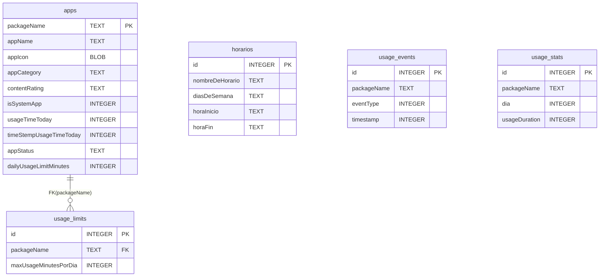

```mermaid
erDiagram
apps {
  packageName TEXT PK
  appName TEXT
  appIcon BLOB
  appCategory TEXT
  contentRating TEXT
  isSystemApp INTEGER
  usageTimeToday INTEGER
  timeStempUsageTimeToday INTEGER
  appStatus TEXT
  dailyUsageLimitMinutes INTEGER
}

horarios {
  id INTEGER PK
  nombreDeHorario TEXT
  diasDeSemana TEXT
  horaInicio TEXT
  horaFin TEXT
}

usage_limits {
  id INTEGER PK
  packageName TEXT FK
  maxUsageMinutesPorDia INTEGER
}

usage_events {
  id INTEGER PK
  packageName TEXT
  eventType INTEGER
  timestamp INTEGER
}

usage_stats {
  id INTEGER PK
  packageName TEXT
  dia INTEGER
  usageDuration INTEGER
}

apps ||--o{ usage_limits : "FK(packageName)"
```